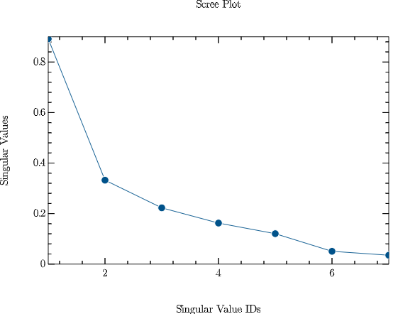

# CMPUtils.jl

CMPUtils stands for Computational Modeling Project Utilities. This is a package developed to support the class projects for Cognitive & Neural Modeling Laboratory. 
Currently the package provides routines to recode image, audio, and text files.

To install this package, go to you package manager and: 
```julia 
add https://github.com/coinslab/CMPUtils.jl
```
### Usage

```julia
using CMPUtils
recodeimage(path_to_folder)
recodeaudio(path_to_folder)
recodetext(path_to_folder)
```

`recodeimage`, `recodeaudio`, and `recodetext`, all accepts only one argument: path to the folder that contains your image/audio/text dataset. 

Once the data is loaded, the function performs Singular Value Decomposition and a plot similar to the one shown below is generated:



Along with the image the following prompt is also generated:

```julia
julia> No. of Features (due to bug in the code that reads user inputs, you might have to enter the no twice, if the program didn't run first time)
```

Now the user will interpret the plot and enter the no. of features. Recoded data is saved as a `.csv` file in the path that was passed to the function. 